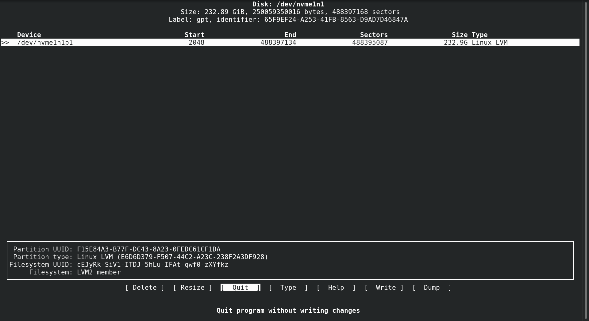
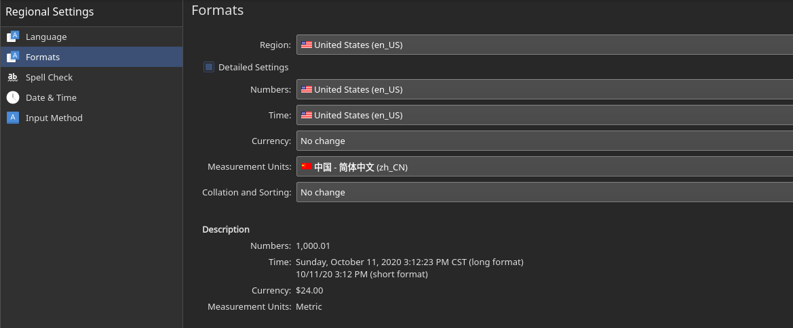
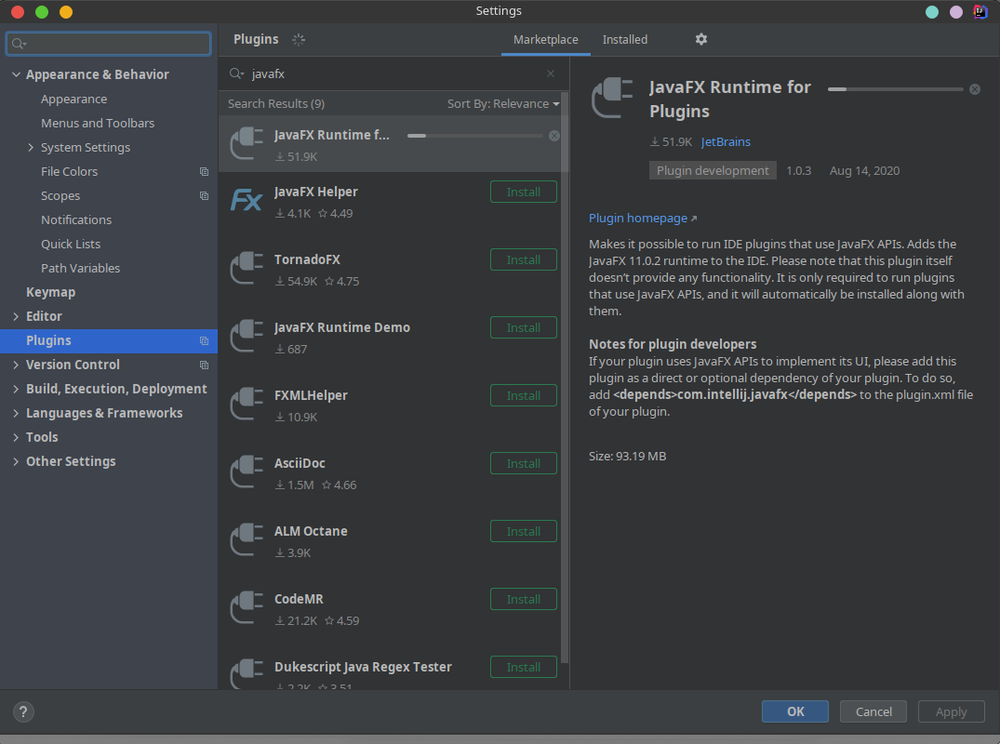



装完系统累死我了，淦！



<!-- more -->

## 系统安装

### 准备工作

- [镜像](https://www.archlinux.org/download/)

  页面中有国内镜像下载方式

  

- U 盘

### 写入镜像

本次使用 U 盘写入，并且由于我电脑已经存在 Manjaro，决定直接用 Manjaro 写入镜像。

如果使用 Windows 写入，参照  操作。

```shell
sudo dd bs=4M if=/path/to/archlinux.iso of=/dev/sdx status=progress && sync
# sdx为U盘位置，自行更改
```

### 安装前的配置

1. 插入 U 盘，在 BIOS 中将其作为第一启动项

2. 启动设备，进入 Archiso

3. 检查引导方式

   ```shell
   ls /sys/firmware/efi/efivars
   # 如果不存在结果则是BIOS引导，反之是UEFI启动
   ```

4. 连接网络（无线网络）

   ```shell
   iwctl
   device list # 显示网络设备，比如我是wlan0
   station wlan0 scan # 扫描无线网络
   station wlan0 get-networks # 获取无线网络
   station wlan0 connect SSID # 连接网络，SSID自行修改
   # 如果存在密码会让你输入，照做即可
   # 退出iwctl
   ping baidu.com # 测试下网络连接是否正常
   ```

5. 磁盘分区

   ```shell
   lsblk # 查看磁盘
   ```

   这里我使用 [LVM 分区](<https://wiki.archlinux.org/index.php/LVM_(%E7%AE%80%E4%BD%93%E4%B8%AD%E6%96%87)>)方式分区，使用 LVM 分区的好处是能够在系统安装后随意改变分区大小、迁移分区等，比较灵活。

   LVM 的基本组成部分如下：

   - 物理卷 (PV)
     一个可供存储 LVM 的块设备. 例如: 一块硬盘, 一个 MBR 或 GPT 分区, 一个回环文件, 一个被内核映射的设备 (例如 dm-crypt).它包含一个特殊的 LVM 头。
   - 卷组 (VG)
     物理卷的一个组，作为存放逻辑卷的容器。
   - 逻辑卷 (LV)
     "虚拟/逻辑卷"存放在一个卷组中并由物理块组成。是一个类似于物理设备的块设备，例如，你可以直接在它上面创建一个文件系统文件系统。
   - 物理块 (PE)
     一个卷组中最小的连续区域(默认为 4 MiB)，多个物理块将被分配给一个逻辑卷。你可以把它看成物理卷的一部分，这部分可以被分配给一个逻辑卷。

   这里使用**cfdisk**工具分区，将需要的分区类型设置为 LVM（Type 选项），选择 Write 写入分区表。

   **以下命令参照自身情况自行修改：**

   ```shell
   cfdisk /dev/nvme1n1 # 修改nvme1n1（SSD）的分区，如下图
   cfdisk /dev/nvme0n1
   cfdisk /dev/sda
   ```

   

   - 创建物理卷

     ```shell
     pvcreate /dev/nvme1n1p1
     pvcreate /dev/sda4
     pvdisplay # 查看已创建物理卷
     ```

   - 创建卷组

     ```
     vgcreate vgp /dev/nvme1n1p1
     vgcreate vgq /dev/sda4
     vgdisplay # 查看已创建卷组
     ```

   - 创建逻辑卷

     ```shell
     lvcreate -L 225G vgp -n lvroot # 分配225G空间给root分区
     lvcreate -l +100%FREE vgp -n lvswap # 分配剩余空间给swap分区
     lvcreate -l +100%FREE vgq -n lvhome # 分配全部空间给home分区
     ```

   - 挂载分区

     **boot 所在分区我个人使用的大小是 200M，千万不能太小，不然无法使用 LVM 方式！**

     ```shell
     mount /dev/vgp/lvroot /mnt
     mkdir /mnt/boot
     mount /dev/nvme0n1p1 /mnt/boot
     mkdir /mnt/home
     mount /dev/vgq/lvhome /mnt/home
     ```

### 开始安装

#### 编辑镜像源

```shell
vim /etc/pacman.d/mirrorlist
# 将国内源放到最前面
# 163
Server = http://mirrors.163.com/archlinux/$repo/os/$arch
# 清华
Server = http://mirrors.tuna.tsinghua.edu.cn/archlinux/$repo/os/$arch
```

#### 安装基本包

```shell
pacstrap /mnt base linux linux-firmware
```

#### 配置 fastab

用于自动挂载分区

```shell
genfstab -L /mnt >> /mnt/etc/fstab
```

#### 进入 Chroot 环境

```shell
arch-chroot /mnt
```

#### 配置 mkinitcpio

由于根文件系统基于 LVM，因此需要启用 mkinitcpio 钩子，否则系统可能无法启动。

编辑 */etc/mkinitcpio.conf* 文件，在 `block` 和 `filesystems` 之间插入 `lvm2`。

*/etc/mkinitcpio.conf*

```
HOOKS="base udev ... block lvm2 filesystems ... " # '...'是我省略了的内容，不要写省略号上去！
```

然后重新生成 initramfs：

```shell
mkinitcpio -p linux
```

如果报错请自行检查，记得要把 boot 分区至少设置为 200MB，否则会报空间不足的错误。

#### 更改时区

```shell
ln -sf /usr/share/zoneinfo/Asia/Shanghai /etc/localtime
hwclock --systohc
```

#### 网络配置

*/etc/hostname*

```
Secriy-Laptop
```

*/etc/hosts*

```
127.0.0.1 localhost
::1   localhost
127.0.1.1 Secriy-Laptop.localdomain Secriy-Laptop
```

#### 设置密码

```shell
passwd
```

#### 安装引导

这里使用 GRUB

```shell
pacman -S grub efibootmgr # 安装GRUB
grub-install --target=x86_64-efi --efi-directory=/boot --bootloader-id=Arch
grub-mkconfig -o /boot/grub/grub.cfg # 配置
```

#### 安装必需软件

网络管理工具必须安装，否则你没法联网还要回过来下载

```shell
pacman -S iwd networkmanager dhcpcd
systemctl enable --now iwd.service
systemctl enable --now NetworkManger.service # 设置开机自启动并直接启动
```

### 完成安装

```shell
exit # 退出chroot
reboot # 重启
```

## 初始配置

### 配置 GRUB

```shell
grub-mkconfig -o /boot/grub/grub.cfg # 寻找启动项，生成grub配置
```

这里我的机器怎么也找不到 Windows 的启动项了，经过尝试得出解决方案如下：

```shell
pacman -S os-prober
grub-mkconfig -o /boot/grub/grub.cfg
reboot
```

### 配置网络

配置 NetworkManager 使用 iwd

*/etc/NetworkManager/NetworkManager.conf*

```
[device]
wifi.backend=iwd
```

启动 wpa_supplicant

```shell
systemctl enable --now wpa_supplicant.service
systemctl restart NetworkManager.service
```

### 添加普通用户

1. 添加用户

   ```shell
   useradd -m -G wheel secriy # 创建用户
   passwd secriy # 设置密码
   usermod -d /home/Secriy -m secriy # 修改用户目录名
   ```

2. 配置 sudo 权限

   ```shell
   pacman -S sudo # 安装sudo
   EDITOR=vim visudo # 使用vim编辑sudoers文件
   ```

3. 将以下文字取消注释

   ```
   %wheel ALL=(ALL) NOPASSWD: ALL
   ```

### 安装显卡驱动

```shell
# intel
pacman -S xf86-video-intel
# Nvidia
pacman -S nvdia
```

### 安装 Xorg

```shell
pacman -S xorg # 安装所有程序包
```

### 安装 KDE(Plasma)

个人使用，可以选择其他 DE

```shell
pacman -S plasma kde-applications
```

### 安装 sddm

```shell
pacman -S sddm
systemctl enable sddm
```

### 安装 NetworkManager 图形化组件

```shell
pacman -S nm-connection-editor network-manager-applet plasma-nm
```

安装完就可以重启了

## 完整配置

### 配置 AUR 源

```shell
sudo pacman -S archlinuxcn-keyring
# 安装blackarch
curl -O https://blackarch.org/strap.sh
sudo chmod +x strap.sh
./strap.sh
```

*/etc/pacman.conf*

```
# archlinuxcn源
[archlinuxcn]
SigLevel=TrustedOnly
Server = https://mirrors.ustc.edu.cn/archlinuxcn/$arch

# blackarch源，主要提供渗透测试工具，普通用户无需添加
[blackarch]
SigLevel = Optional TrustAll
Server = https://mirrors.ustc.edu.cn/blackarch/$repo/os/$arch
```

```shell
sudo pacman -Syyu # 更新系统和软件包，无论是否安装blackarch都必须执行
```

### 基础软件安装

```shell
sudo pacman -S git wget zsh apper yay ranger # ranger为命令行下文件管理工具
```

### 配置 oh-my-zsh

```shell
chsh -s /usr/bin/zsh # 修改默认shell
sh -C "$(wget https://acgfate-dl.oss-cn-shanghai.aliyuncs.com/install.sh -O -)"
sudo vim ~/.zshrc # 修改配置文件
```

主题：ys

插件：

- git

- autojump

- zsh-autosuggestions

  ```shell
  git clone git://github.com/zsh-users/zsh-autosuggestions $ZSH_CUSTOM/plugins/zsh-autosuggestions
  ```

- zsh-syntax-highlighting

  ```shell
  git clone https://github.com/zsh-users/zsh-syntax-highlighting.git ${ZSH_CUSTOM:-~/.oh-my-zsh/custom}/plugins/zsh-syntax-highlighting
  ```

### 字体安装

```shell
sudo pacman -S ttf-monaco adobe-source-han-sans-cn-fonts
```

### 系统美化

#### Plasma

- Widgets

  - Active Window Control
  - Application Title
  - Global Menu
  - Netspeed
  - System Loader View
  - Thermal Monitor
  - Color Picker
  - Digital Clock
  - Application Dashboard

- Latte Dock

  ```shell
  sudo pacman -S latte-dock
  ```

#### Grub

**可使用图形化工具：**

```shell
sudo pacman -S grub-customizer
```

1. 下载主题

2. 解压

3. 执行 install.sh 自动安装

4. 修改分辨率

   */etc/default/grub*

   ```
   GRUB_GFXMODE=1920x1080
   ```

5. 修改字体

   ```shell
   sudo grub-mkfont -s 16 -o /boot/grub/fonts/Monaco_Linux.pf2 /usr/share/fonts/TTF/Monaco_Linux.ttf
   ```

   */etc/default/grub*

   ```
   GRUB_FONT="/bot/grub/fonts/Monaco_Linux.pf2"
   ```

   ```shell
   grub-mkconfig -o /boot/grub/grub.cfg
   ```

## 软件安装&配置

### 输入法（fcitx5）

安装

```shell
sudo pacman -S fcitx5 fcitx5-configtool # 主程序、配置工具
sudo pacman -S fcitx5-chinese-addons # 输入法引擎
sudo pacman -S fcitx5-qt fcitx5-gtk # 输入法模块
sudo pacman -S fcitx5-pinyin-zhwiki # 肥猫制作的维基百万词库
sudo pacman -S fcitx5-pinyin-moegirl # 萌娘百科词库
```

配置

_~/.pam_environment_

```
INPUT_METHOD  DEFAULT=fcitx5
GTK_IM_MODULE DEFAULT=fcitx5
QT_IM_MODULE  DEFAULT=fcitx5
XMODIFIERS    DEFAULT=@im=fcitx5
```

*~/.xprofile*

```
export GTK_IM_MODULE=fcitx5
export XMODIFIERS=@im=fcitx5
export QT_IM_MODULE=fcitx5
fcitx5 &
```

注销后重新登录

### 必需软件

- xsettingsd：解决 KDE 下 wine 程序不能运行的问题
- ttf-wps-fonts：WPS 必需字体

### 其他配置

- 启动 SSH 服务

```shell
sudo systemctl enable sshd.service
sudo systemctl start sshd.service
```

### 将 xsettingsd 设置为自启动


### 卸载无用软件包

```shell
sudo pacman -R package-name
```

### 清理软件包

```shell
sudo pacman -Scc # 清理安装包缓存
sudo pacman -R $(pacman -Qtdq) # 清理孤立软件包
```

## 软件 & 工具

### 日常软件

#### 网络

- 浏览器：
  - Chrome
  - Chromium
  - FireFox
  - Tor Browser
- v2ray GUI：Qv2ray
- 邮箱：Thunderbird + birdtray
- 网盘：
  - 百度网盘
  - MEGA Sync
- 下载:
  - aria2
  - uget
  - qBittorrent：qbittorrent

#### 通讯

- Telegram
- Tim：deepin.com.qq.office
- 微信：deepin-wine-wechat

#### 视频

- VLC

#### 音频

- 网易云音乐

#### 图像

- Gwenview

#### 办公

- WPS Office

#### 阅读

- Typora
- Calibre
- 电子书阅读器：
  - Foliate
- PDF 阅读器：
  - Evince
- 翻译器：
  - Crow Tanslate

#### 其他

- 输入法：fcitx5
- 虚拟机：VMware Workstation
- 截图：flameshot
- 文件管理器：
  - dolphin
  - ranger
- FTP 工具：FileZilla
- 单词记忆：Anki
- 密码管理：KeePassXC
- 计算器：SpeedCrunch
- 输出本机信息：neofetch
- 彩色输出：lolcat

### 开发工具

#### 语言

- Node.js
- Go
- Python 3/2

#### 编辑

- vim
- leafpad
- Visual Studio Code
- Sublime Text 3
- TeX Live
- TeX Studio

#### IDE

- Intellij-IDEA
- Goland
- PyCharm
- Android Studio
- Matlab

#### 数据库

- SQLite
- MariaDB
- Navicat15 Premium
- DB Browser for SQLite

#### 测试

- Postman

#### 代码管理

- GitHub Desktop
- Git

#### 其他

- Zeal：zeal
  离线文档阅读器
- iPython：ipython
- Docker：docker
- npm

### 安全工具

- HTTP 抓包
  - Charles：charles
- 流量分析
  - Wireshark：wireshark
- 信息查看
  - GHex：ghex
    十六进制查看器

## 踩坑记录

1. 无法使用中文

   根据上文的输入法配置，软件基本上都是能够正常使用中文的。由于我的系统语言是默认的英文，终端无法显示中文字符，将语言格式化改为 UTF8 格式即可。

   ```shell
   $ locale
   LANG=en_US.UTF-8
   LC_CTYPE="en_US.UTF-8"
   LC_NUMERIC=en_US.UTF-8
   LC_TIME=en_US.UTF-8
   LC_COLLATE="en_US.UTF-8"
   LC_MONETARY="en_US.UTF-8"
   LC_MESSAGES="en_US.UTF-8"
   LC_PAPER="en_US.UTF-8"
   LC_NAME="en_US.UTF-8"
   LC_ADDRESS="en_US.UTF-8"
   LC_TELEPHONE="en_US.UTF-8"
   LC_MEASUREMENT=zh_CN.UTF-8
   LC_IDENTIFICATION="en_US.UTF-8"
   LC_ALL=
   ```

   

   经测试，Tim 和各类软件均能够正常输入中文。

2. 无线网络冲突

   经常遇到连接无线网需要超级长时间的问题，并且大多数情况都会失败。后来发现是网络工具冲突，wpa_supplicant 和 NetworkManager 不要分开安装，直接安装 NetworkManager 即可，另外将 NetworkManager 的 backend 替换为 iwd。具体原因细节我没有深究，文章已经修改为正确的步骤。

3. Tim 部分中文显示异常（显示为方块）

   修改*/opt/deepinwine/tools/run.sh*，将**WINE_CMD**改为以下文本：

   ```sh
   WINE_CMD="LC_ALL=zh_CN.UTF-8 deepin-wine
   ```

4. Jetbrains 系列软件无法使用 GlobalMenu（全局菜单）

   通过点击 Help->Show Log in Dolphin 查看日志，发现报错如下：

   

   因此可以确定是找不到 JavaFX 环境，在**Plugins Marketplace**下载安装即可。

   
