

汇编语言的学习笔记，主要是对《汇编语言》（王爽）的总结、概括、补充以及实践。



<!-- more -->

## 基础知识

### 机器语言

机器语言是机器指令的集合，以二进制表示，每一种 CPU 都有自己的机器指令集，机器指令指定 CPU 进行特定的任务。

### 汇编语言

机器指令全部由二进制编写，人类难以编写和调试，因此汇编语言出现了。汇编程序通过编译器生成对应的机器码，由 CPU 进行执行。例如汇编指令 `MOV AX, BX` 编译生成的机器码为 `1000100111011000`（8086 CPU）。

汇编语言由以下三个部分组成：

1. 汇编指令，如 `MOV`，是机器指令的助记符，和机器指令一一对应；
2. 伪指令，没有对应的机器码，编译器对其进行处理，计算机并不执行；
3. 其他符号，如 `+ - * /` 等，由编译器识别，没有对应的机器码。

### 存储器

向 CPU 提供的程序指令以及数据都由存储器保存，需要时调入 CPU 执行，这里的存储器即内存。

> 指令和数据在内存或磁盘上并没有差别，都是一串二进制信息，同样的一串二进制数位如 `1000100111011000` 可以被看作是指令 `MOV AX, BX` 也可以被看作是数据 `89D8H`。CPU 会按照特定机制把信息看作是指令或是数据，比如在不同的 CPU 指令周期把信息认作不同的类型。

#### 存储单元

存储器被抽象为线性的若干个单元，从 0 开始编号，如存储器有 128 个存储单元，编号从 0 ~ 127。每个存储单元大小为 8 bits 即 1 byte。

#### CPU 读写存储器

CPU 需要通过以下三种信息来进行存储器上的数据读写：

- 存储单元的地址（地址信息）。

- 芯片或器件的选择，读或写的命令（控制信息）。

- 读或写的数据（数据信息）。

步骤如下：

1. CPU 通过**地址线**将地址信息（如指定存储器 3 号单元）发出。
2. CPU 通过**控制线**发出内存读命令，并选中需要用到的存储器。
3. 存储器将 3 好单元内的数据通过**数据线**送入 CPU。

### 三类总线

#### 地址总线

一根地址线可以表示 0、1 两个状态，因此可以寻 0、1 两个地址，10 根地址线可以寻址 $2^{10}$ 即 1024 个地址（0 ~ 1023）。

地址总线的宽度决定了 CPU 的寻址空间大小。

#### 数据总线

单根数据线可以一次传送 1 bit 的信息，8 根数据线可以一次传送 8 bits 的数据。8086 CPU 有 16 根地址线，可以一次传送 16 位数据，即 2 bytes。读超过数据总线宽度的数据时需要多次读取。

数据总线的宽度决定了 CPU 单次能传输的数据量。

#### 控制总线

单根控制线提供了对外部部件的某一控制信息，如“读信号输出”控制线负责向外界传递读信号。

控制总线的宽度决定了 CPU 对其他器件的控制能力。

### 内存地址空间

不同的设备提供了不同的硬件适配器（即接口卡），如网卡的网络适配器、显卡的显示控制器等，计算机要通过给硬件适配器传送命令来完成一系列操作。通常硬件适配器上会有一个存储空间来暂存数据，如显卡的显存用来临时存放将要显示的数据。这些设备的存储器都需要分配地址。

CPU 将分布在不同硬件上的各类物理存储器看作是一个逻辑存储器的一部分，也就是说在 CPU 眼里这些存储器组成了一个线性的存储器（内存地址空间）。比如让内存条占用内存地址空间的 0 \~ 1023 地址，让显存占用 1024 \~ 1151 地址。想对显存读写的时候 CPU 可以直接指定 1024 \~ 1151 地址区间。

地址空间的大小取决于 CPU 的寻址能力，即地址总线的宽度。比如 32 位系统环境下，我们知道其可寻址的地址空间大小为 $2^{32}$ 即 4294967296 bytes，但它实际能给我们最常见的内存条分配的地址空间并非这么多，显存、网卡等都要占据一部分地址空间。事实上，32 位 Windows 7/8 系统支持的最大内存只有 3.25GB 左右。

理论上 64 位系统环境下，可使用的地址空间高达 16777216TB，但由于很多 64 位 CPU 使用 40 位地址线，导致其最终地址空间大小只有 1TB。而操作系统和主板的限制让这个大小实际上远没有那么多。

在 Windows 操作系统上，可以使用命令 `wmic memphysical get maxcapacity` 查看设备支持的最大内存条容量（单位：KB）：

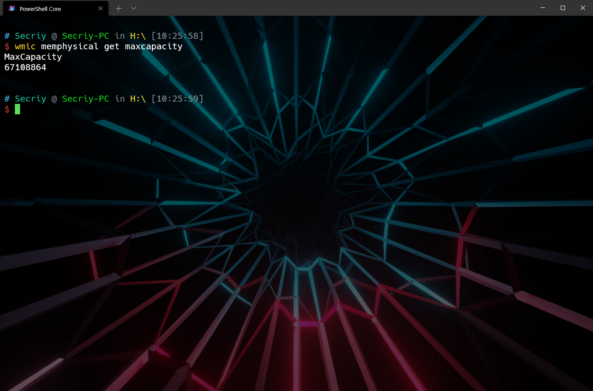

在我的设备上，最高也就只有 64GB，这受限于主板能够提供的内存条插槽数，如主板支持单根 32GB，那么双插槽就支持 64GB。

如何直观地了解什么是内存地址空间？显存在哪里？在 Windows 操作系统上，可以打开设备管理器查看：


可以看到如 SATA 控制器、显卡、NVMe 控制器、网络适配器等设备都会被分配地址空间资源。因此我们知道，通过同一套内存地址，我们能够访问所有的这些存储器。

## 寄存器

CPU 从内存中读取指令和数据然后对其进行处理，因此 CPU 内部还需要暂存这些指令和数据，由寄存器完成这项任务。

CPU 的组成：

- 运算器，负责进行运算。
- 寄存器，负责存储信息。
- 控制器，控制各种器件工作。
- 内部总线，负责连接各部件，在其中传送数据。

8086 CPU 中的寄存器（14 个）：AX、BX、CX、DX、SI、DI、SP、BP、IP、CS、SS、DS、ES、PSW。

### 通用寄存器

上述 8086 CPU 的寄存器中，AX、BX、CX、DX 为通用寄存器，用于存放一般性的数据。其存储大小皆为 16 bits。

8086 CPU 为了兼容为上代 8 位寄存器的 CPU 编写的程序，每个通用寄存器可以分为两个 8-bit 寄存器使用：

- AX 可以分为 AH 和 AL。
- BX 可以分为 BH 和 BL。
- CX 可以分为 CH 和 CL。
- DX 可以分为 DH 和 DL。

### 字在寄存器中的存储

对于 8086 CPU，它可以一次性处理以下两种数据：

- 字节（byte），8 bits。
- 字（word），16 bits。

一个字由两个字节组成，分别称为高位字节和低位字节，字可以正好存在一个通用寄存器中。

### 指令示例

|   汇编指令    |                   操作                   |
| :-----------: | :--------------------------------------: |
| MOV AX, 4E20H |          将 4E20H 送入寄存器 AX          |
|  MOV AX, BX   |     将寄存器 BX 的内容送入寄存器 AX      |
| ADD AX, 1406H |          将 AX 的内容加上 1406H          |
|  ADD AX, BX   | 将 AX 的内容加上 BX 的内容，存储在 AX 中 |

指令的两个数据对象必须位数一致。16 位寄存器只能存 16 位数据，如操作 ADD 指令后超出 16 位，则只保留低 16 位在寄存器中。直接操作 AL 溢出后并不能将溢出值放入 AH 中，和 16 位一样只保留低 8 位。

### 物理地址

对于 16 位 CPU（如 8086）：

- 运算器一次最多处理 16 位数据。
- 寄存器最大宽度为 16 位。
- 寄存器与运算器之间的通路为 16 位。

8086 CPU 有 20 根地址总线，内存单元物理地址需要用 20 bits 存储，但它是 16 位 CPU，因此需要两个寄存器来保存一个地址。

第一个寄存器提供段地址，第二个寄存器提供偏移地址，最终通过 `[物理地址] = [段地址] * 16 + [偏移地址]` 来计算出实际的物理地址，如：

- 段地址 `1000H`，偏移地址 `124AH`，得出物理地址 `1124AH`。

- 段地址 `1230H`，偏移地址 `00C8H`，得出物理地址 `123C8H`。

对段地址（16 进制表示）乘以 16 实质是左移一位。`1000H` 左移一位即 `10000H`。

不同的段地址和偏移地址能够得到相同的物理地址。

段地址实际上是 CPU 对内存的抽象划分，内存本身并没有段的概念，由于偏移地址由 16 位存储，即可以表示 64KB 大小的地址空间，因此一个段的最大容量为 64KB。也就是说给定一个段地址，无法寻址到从它开始 64KB 以外的内存单元。

### 段寄存器

8086 CPU 有四个段寄存器：CS、DS、SS、ES。

这些段寄存器用来存放段地址。

### CS 和 IP

IP 是一个指令指针寄存器，即用于存放内存物理地址的偏移，通过 CS 和 IP 中的内容就可以生成一个物理地址。

如 CS（`2000H`），IP（`0000H`），由地址加法器计算出物理地址为 `20000H`，通过地址总线寻址，由数据总线将其中的指令和数据调入 CPU 执行。这期间 IP 中的偏移位会增加，指向下一个内存中的指令地址。8086 CPU 刚启动时 CS 和 IP 的默认值分别为 `FFFFH` 和 `0000H`，即初始从 `FFFF0H` 取指执行。CPU 通过 `CS:IP` 指定的物理地址来确定一个内存中的信息是否是指令，`CS:IP` 指向的内存单元内容被 CPU 看作是指令。

要想修改 CS 和 IP 的内容无法通过 MOV 指令完成，可以通过 JMP 指令（JMP [段地址]:[偏移地址]）来操作：

```assembly
JMP 2AE3:3
JMP 3:0B16
```

执行后 CS 和 IP 的值会被修改为指定的值。

### 代码段

通过段的抽象，可以将指令都放在指定的一些内存连续的段中，被称为代码段，这种方式能够让指令聚集在连续的内存单元中，方便管理和隔离。

## DEBUG 程序实验

可以通过 DOSBox 来模拟 DOS 环境，在其下进行实验。

### 配置环境

1. 下载安装 [DOSBox](https://www.dosbox.com/download.php?main=1)。
2. 下载 [_DEBUG.zip_](https://upyun.secriy.com/downloads/DEBUG.zip) 解压到固定目录，如 DOSBox 安装目录下。
3. 打开 DOSBox，执行 `mount x path_to\DOSBox`，将 DOSBox 目录挂载到 `x` 盘符。
4. 执行 `X:`，切换到 `x` 盘符下。
5. 执行 `cd path_to` 来切换到 _DEBUG.zip_ 的解压路径，如 `cd DEBUG`。

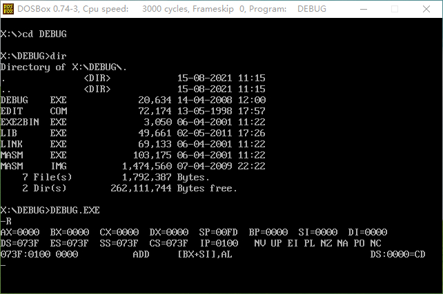

### DEBUG 常用命令

- R，查看、改变 CPU 寄存器中的内容。
- D，查看内存中的内容。
- E，改写内存中的内容。
- U，将内存中的机器指令翻译成汇编。
- T，执行一条机器指令。
- A，以汇编格式在内存中写入一条机器指令。

#### R


如上图，R 命令可以查看 13 个寄存器的内容，其中 `073F:0100` 即为 `CS:IP` 所指向的内存单元，其内容为 `0000`，后面的 `ADD [BX+SI],AL` 则是 `0000` 对应的汇编指令，当该内存单元内容被填充为全零时，就会被反汇编为该指令，实际无意义。

R 命令还可以用于修改某一寄存器的内容：

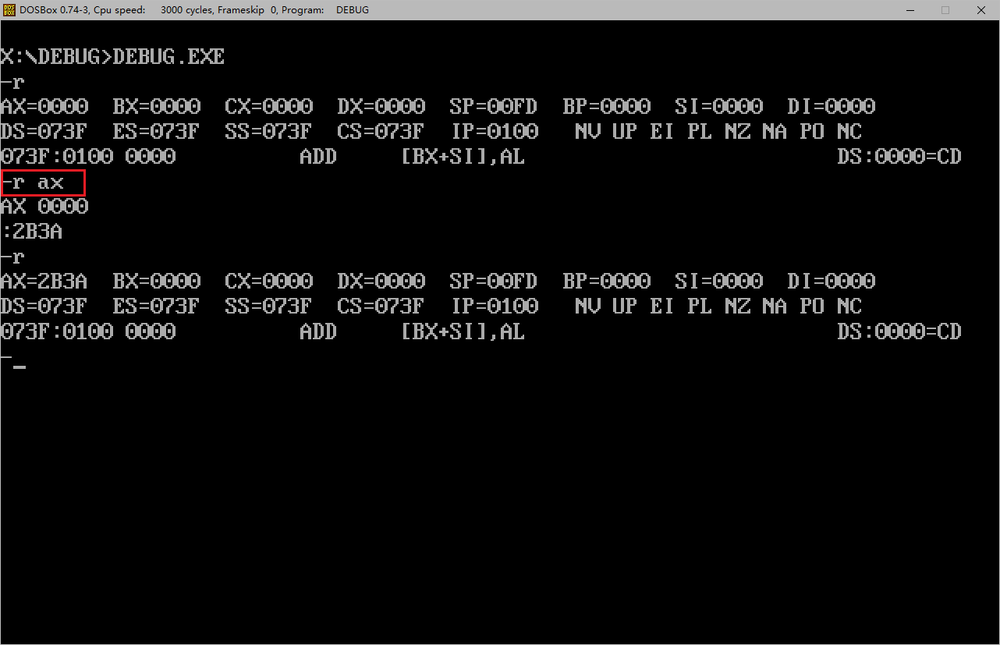

同样地，可以用来修改 CS、IP 的内容，让其执向另一个内存单元。

#### D

D 命令可以用于查看 `CS:IP` 所指向内存单元及其后的一段连续单元（128 个单元）：


内容分为三部分：

- CS:IP
- 内存单元内容
- 内存单元内存对应的 ASCII 码（无对应 ASCII 字符的数值和零值一样显示为`.`）

连续执行则会从上次的末尾地址继续：


也可以自行指定查看的内存单元以及限定范围：

`D [段地址]:[偏移] [结尾偏移地址]`

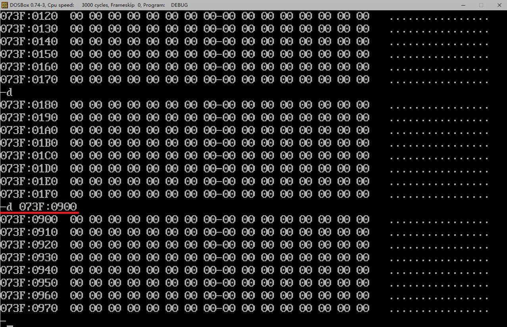

限定范围的使用如 `D 1000:0 9` 则显示 `1000:0` \~ `1000：9` 的内容。

#### E

E 命令可以用于改写内存中的内容，如将 `1000:0` 开始的 16 个单元（16 字节）修改为 `0` \~ `F`：

`E [CS:IP] [DATA]...`

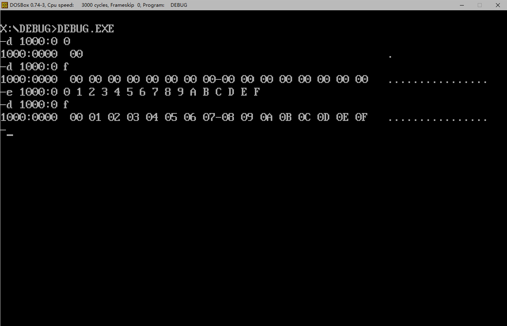

直接输入 `E [CS:IP]` 会进入交互式修改，输入一个值再输入空格则进入对下一个值的修改：


E 命令也可以用于直接输入字符和字符串：


能让 CPU 执行的机器码本质上就是二进制数据，因此如要写入汇编程序，直接往内存单元写对应的机器码即可。

#### U

U 命令用于查看一段内存单元对应的汇编指令：

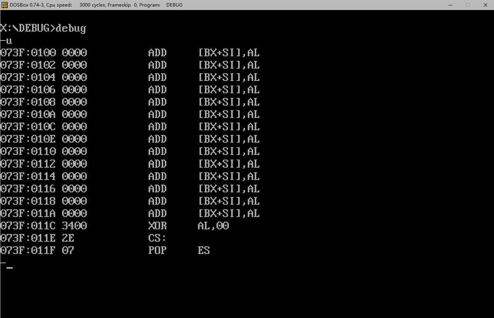

同样的可以指定地址来查看：

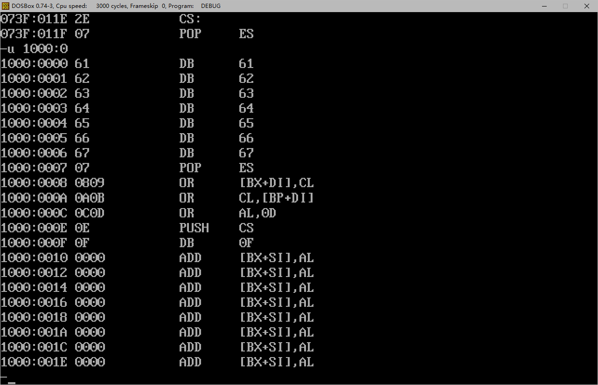

这其中很多数据本身并非汇编指令，但仍会被翻译（指令和数据在存储上并无区别，都是二进制，它们只在解释上有区别）。

我们可以先往里写如下的程序：

```assembly
mov ax,0001 ; b80100
mov cx,0002 ; b90200
add ax,cx   ; 01c8
```


#### T

T 命令用于执行 `CS:IP` 指向的一条或多条指令：

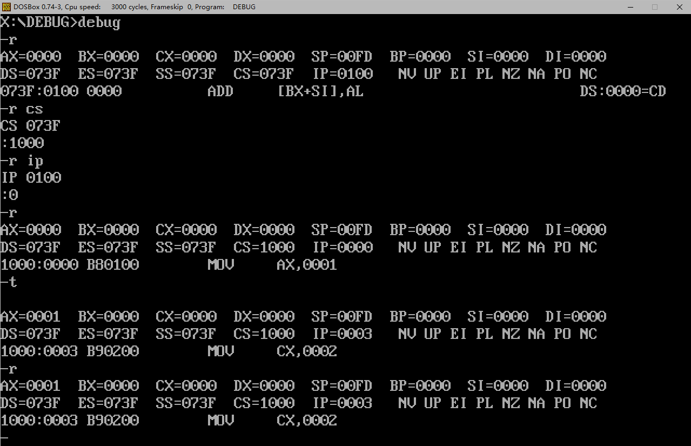

以上命令执行的步骤为：

1. 修改 `CS:IP` 为 `1000:0`。
2. T 命令执行。
3. 查看结果。

可以看到，执行第一次 T 命令后，AX 寄存器的内容被成功修改为 `0001`，IP 的值 +3 则指向了下一条指令，这是因为指令 `mov ax,0001` 占用了 3 个字节。

我们把之前写入的三条指令都执行完：


最后得到 `AX=0003`，符合预期的结果。

#### A

A 命令用于直接向内存中写入汇编指令，而不是直接写入机器码：

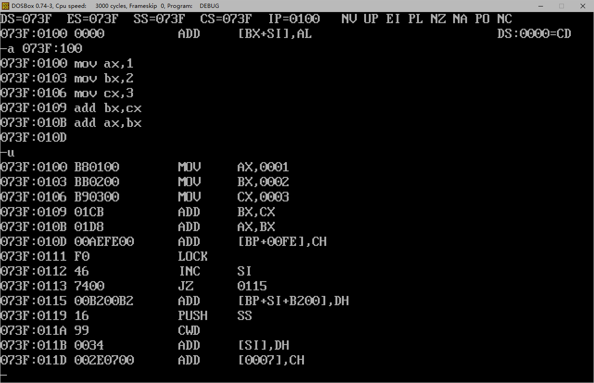

这里我们写入了五条汇编指令，用 U 命令查看可以发现成功存入了内存中。用 T 命令将他们全部执行：

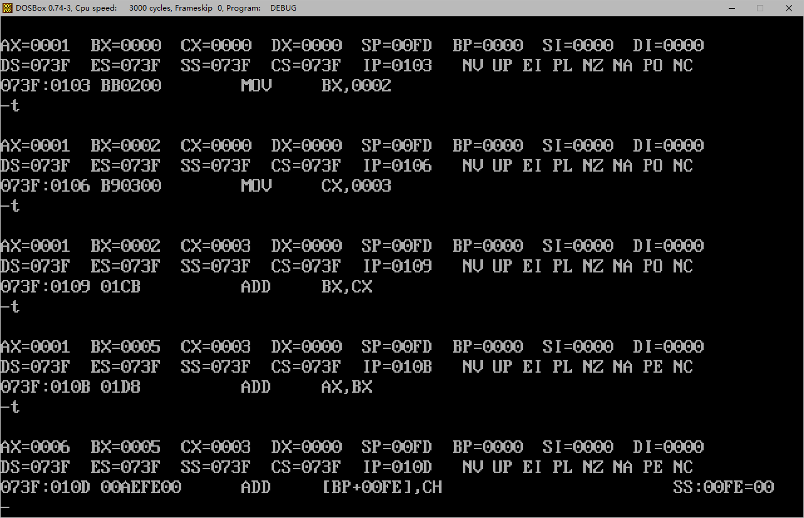

### 实验

#### 修改显存内容

按照内存地址空间的概念，有一部分地址空间被分配给了显存，在 8086 CPU 环境下它的准确范围是 `000A0000` \~ `000BFFFF`。我们通过下面的操作来修改 `B8100H` 开始的一段内存单元：

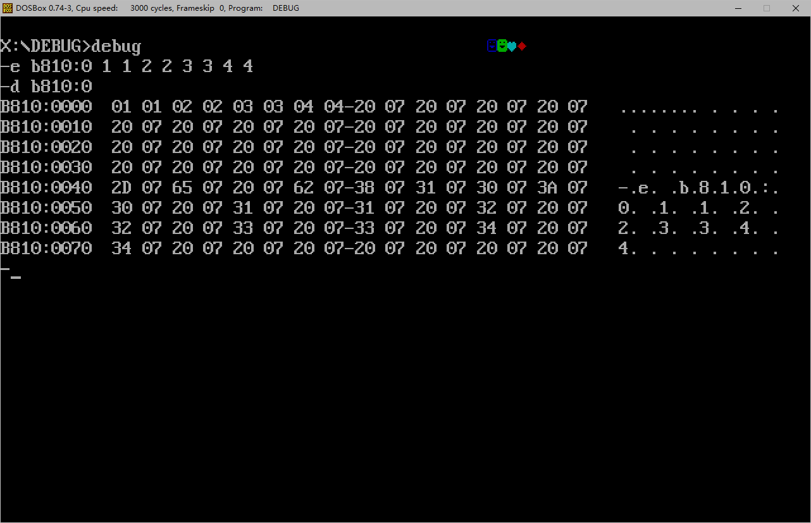

从上面的显示来看，显存中的数据已经被改变了，请注意右上角的几个字符。

我们再改变一下输入的数据：

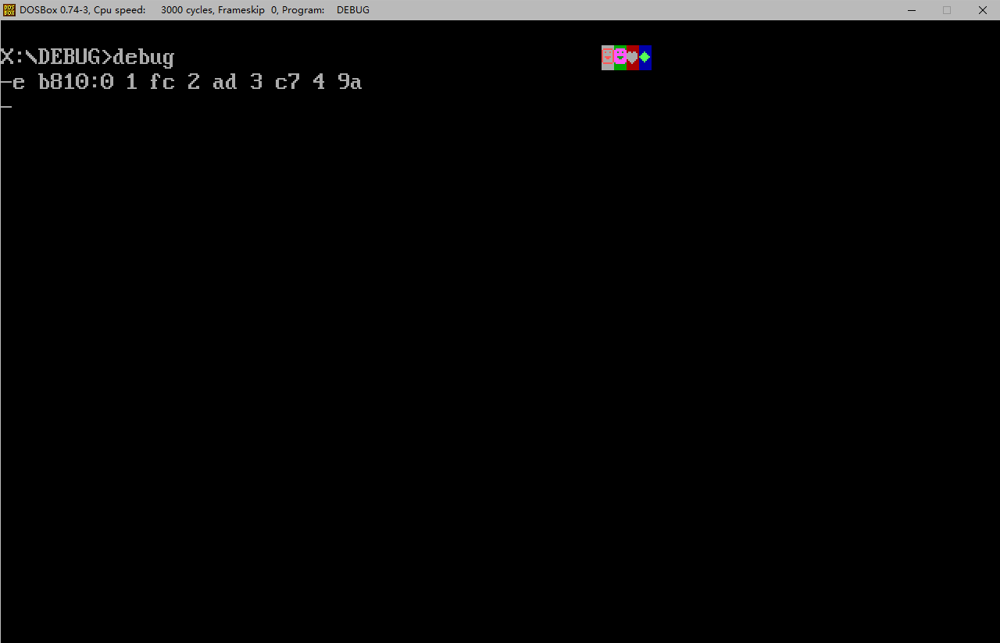

我们输入的数据总共有 8 bytes，观察显示出的符号可以发现总共有四个，实际上输入的数据每两个一组，分别对应着一个符号的内容和颜色。

这都取决于 DOS 中的设置，比如在 DOS 中色值-颜色对应如下：

| 色值  |  颜色  | 色值  | 颜色  | 色值  |   颜色   | 色值  |  颜色  |
| :---: | :----: | :---: | :---: | :---: | :------: | :---: | :----: |
|   0   |  黑色  |   4   | 红色  |   8   |   灰色   |   C   | 淡红色 |
|   1   |  蓝色  |   5   | 紫色  |   9   |  淡蓝色  |   D   | 淡紫色 |
|   2   |  绿色  |   6   | 黄色  |   A   |  淡绿色  |   E   | 淡黄色 |
|   3   | 浅绿色 |   7   | 白色  |   B   | 淡浅绿色 |   F   | 亮白色 |

颜色由两个十六进制值表示，前者为前景色，后者为背景色，因此 07 就代表黑底白字。

那么前面的 1、2、3、4 就代表了四个符号，这来自[Code Page 437 字符集](https://en.wikipedia.org/wiki/Code_page_437)。

## 寄存器（内存访问）

### 内存中字的存储

CPU 中一个字（16 bits）存在一个寄存器中，但内存的最小单元为字节，一个字需要存在两个内存单元中，低位字节放在低地址单元，高位字节放在高地址单元。由此引入**字单元**的概念，即存放一个字型数据（16 bits）的内存单元。字单元占用 $n$、$n+1$ 内存单元则被称为 $n$ 地址字单元，如一个字占用 4、5 两个内存单元，则被称为 4 地址字单元。

### DS 和 [addresss]

8086 CPU 中，有一个 DS 寄存器，用于存放待访问**数据**的段地址。如读取 `10000H` 内存单元的内容，可以使用如下程序：

```assembly
mov bx, 1000H
mov ds, bx
mov al, [0]
```

其中，往 DS 写入了 `1000H`，因此 DS 的内容为 `1000H`，这是段地址。最后一句操作的 `[...]` 用于指定偏移地址，使用这种语法，CPU 会自动读 DS 内容（段地址），附加偏移地址（"[]"内数字）按照前文中的计算方式生成物理地址，最后读取物理地址指向的内存数据写入目标寄存器，即该语法最终可以直接读内存数据。

8086 CPU 不支持直接送数据到段寄存器，因此无法使用 `mov ds, 1000H` 这种写法，这属于 8086 CPU 的硬件设计问题。

DS 与 CS 的区别在于 CS 用于存储待执行**指令**的内存段地址，而 DS 存放的是待取**数据**的段地址，数据是不应被当作指令执行的。

### 字的传送

上一节中的指令 `mov al, [0]` 只是将一个字节的数据写入 AL 寄存器，这是因为 AL 寄存器大小为 8 bits。而 8086 CPU 有 16 根数据线，一次性可以传送 16 bits 的数据，即一个字。使用同样的语法即可做到传送 16 bits 数据，如 `mov ax, [0]`，因为 AX 是 16-bit 寄存器，可以直接读 16 bits 的数据存入。

示例：

内存内容：

| Address | Data |
| ------- | ---- |
| 0x10000 | 23H  |
| 0x10001 | 11H  |
| 0x10002 | 22H  |
| 0x10003 | 66H  |

程序：

```assembly
mov ax, 1000H
mov ds, ax
; ds = 1000H
mov ax, [0]
; ax = 1123H
mov bx, [2]
; bx = 6622H
mov cx, [1]
; cx = 2211H
add bx, [1]
; bx = 8833H
sub bx, cx
; cx = 6622H
```

这里的 `sub` 指令是减法指令，前值减去后值，结果存在左侧表示的寄存器中。

### mov、add、sub

目前已知 `mov` 指令有以下几种操作：

1. mov 寄存器，数据

2. mov 寄存器，寄存器

3. mov 寄存器，内存单元

4. mov 内存单元，寄存器

5. mov 段寄存器，寄存器

从第五条可以知道，CPU 中存在段寄存器与通用寄存器之间的通路，因此可以推测也存在反向通路，即段寄存器 -> 寄存器。

经过验证，得到 `mov ax, ds` 合法。

从第四条可以知道，CPU 中存在寄存器到内存单元的通路，而刚刚得出段寄存器可以传送数据到寄存器的结论，由此判断段寄存器可以传送数据到内存单元，如 `mov [0], cs`。

经过验证，指令合法。

根据第三、第五条可以推测存在内存单元 -> 段寄存器的操作，如 `mov ds, [0]`。

经过验证，指令合法。

经过实验，`add` 和 `sub` 指令无法操作段寄存器，类似 `add ds, ax` 的指令不合法。

### 数据段

同之前提到过的代码段一样，将需要操作的数据放在同一段内存单元中可以方便程序的执行和内存的管理，这就是数据段。要访问数据段中的数据，可以先用 DS 段寄存器存放数据段的地址，根据需要寻址具体单元。

### 栈

栈是一种 LIFO（Last in first out）的数据结构，但在这里不去讨论它的数据结构层面内容，具体可以参考其他资料。这里只提一点：在程序化的角度，应当有指示栈顶位置的标记。

现在的 CPU 中都有栈的设计，如 8086 CPU 就提供了以栈形式操作内存空间的指令。也就是说通过这些指令，可以将部分内存空间当作栈结构使用。

#### PUSH & POP

PUSH 即入栈，对应指令如 `push ax`，表示将 AX 中的内容送入栈中。

POP 即出栈，对应指令如 `pop ax`，表示将栈中的数据送入 AX 寄存器。

PUSH 和 POP 操作的数据传送单位都是字。

可以发现，上述两条指令并没有指定栈的位置在哪，那么如何确定栈空间？根据前面学习的套路，栈很显然也是由某些寄存器指定的，在 8086 CPU 中则是段寄存器 SS 和寄存器 SP。和 `CS:IP` 的表示形式相同，**栈顶地址**由 `SS:SP` 指定，SS 和 SP 分别指定段地址和偏移，注意这里是栈顶地址。

执行 `mov ax, 0123H` 后再执行 `push ax` 即把数据 `0123H` 送入栈，栈顶指针（`SS:SP`）往低地址方向移动，而数据也按照低地址存放低位字节，高地址存放高位字节的规则将一个字存入两个内存单元。下图中，`SS:SP` 的值为 `1000EH`，即指向 `23H`。其中，SS 的值为 `1000H`， SP 的值为 `000EH`。

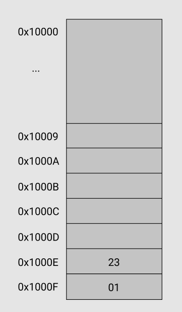
