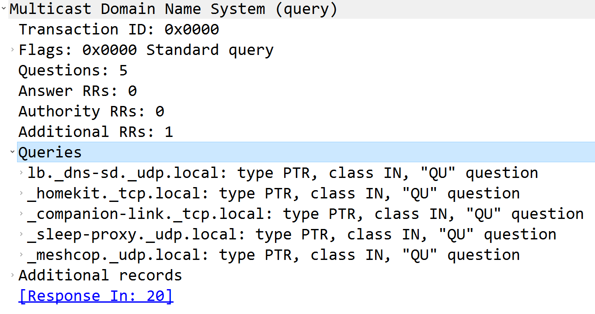
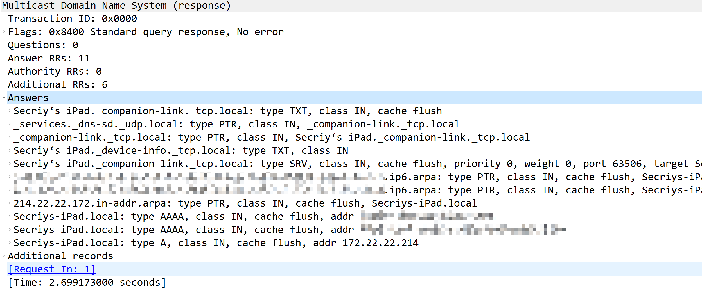



玩 Wireshark 的时候无意中发现了一个叫 mDNS 的协议，有些好奇就打算深入了解一下。



<!-- more -->

## 简介

**multicast DNS (mDNS)** 协议，即多播 DNS 协议，顾名思义和 DNS 有相似之处。当局域网内没有传统的 DNS 服务器时，使用 mDNS 可以让局域网内的主机相互发现。

mDNS 使用的端口为**5353 端口**，遵从 DNS 协议。

### 多播（multicast）

**多播**又叫组播，区别于**广播**，它只会将数据发送给指定的**多播组**，更不是点对点的**单播**。多播优于广播的地方之一是它更加节省网络带宽。

IP 多播通信依赖于 IP 多播地址，在 IPv4 中它属于 D 类地址，范围从 224.0.0.0 到 239.255.255.255，并被划分为**局部链接多播地址**（224.0.0.0 - 224.0.0.255）、**预留多播地址**（224.0.1.0 - 238.255.255.255）以及**管理权限多播地址**（239.0.0.0 - 239.255.255.255）。

局部链接多播地址为路由协议和其他用途保留，路由器不会转发该范围内的 IP 报文；预留多播地址可以用于全球范围或者网络协议；管理权限多播地址供组织内部使用，不能用于互联网，可以限制多播范围。

多播组就是使用同一个 IP 多播地址接收数据报的主机，多播组成员可以随时加入和离开，并且数量不受限制，一台主机也可以属于多个多播组。不属于该多播组的主机同样可以给这个多播组发数据报。

mDNS 使用的多播地址是**224.0.0.251**，属于局部链接多播地址。它使用的 IPv6 地址为**ff02::fb**。

### 为什么要有 mDNS？

在局域网内，我们和其他主机直接交换数据是通过 MAC 地址，在上层则是由 IP 地址来查找，二者可能在本机的 ARP 缓存中找到。但当 ARP 缓存中没有这两个东西该怎么办呢？由于 DHCP 的使用，对方的 IP 地址可能不固定，因此无法保证由 IP 地址找到目标主机。通过 MAC 地址来寻找似乎可行，因为大部分情况下 MAC 地址是固定的，然而这里有个问题：如果我要使用链路层之上的协议，那我就必须要有 IP 地址，除非直接通过链路层发送数据。无论如何，我们都需要对方的 IP 地址，而 mDNS 就是用于寻找指定设备的 IP 地址的。用什么找呢？答案是主机名。

## 过程

如果一台主机开启了 mDNS 服务，那么当它进入某一局域网时会向局域网内所有的主机发送一条组播消息，在 Wireshark 中可以看到这个消息的信息：

可以看到 mDNS 下层是 UDP，提供尽最大努力交付。继续看它的报文内容：

其中有个 Questions 字段为 5，即对应 Queries 有 5 条。

这里解释下里面的一些字段和词汇：

- QU：单播
- QM：多播
- A 记录：主机名 - IPv4
- AAAA 记录：主机名 - IPv6
- PTR 记录：标识服务实例名称和服务类型之间的关系
- SRV 记录：标识服务实例名称对应的主机名和端口号
- TXT 记录：对某个服务实例提供的附加信息，按照 Key/Value 对提供
- ANY 记录：任意类型，一般用于查询

可以看到局域网内的主机名用`.local`将其与网络主机域名区分开，从这些名字（比如 homekit）里可以看出，这是一台在查找局域网内 HomeKit 设备的主机，没错就是我的 iPad。另外上面还有`_tcp`、`_udp`等标识服务所使用协议的字段。

这是 mDNS 的第一个查询请求，它还会有一个对应的应答请求：

从图中可以看到发送方的主机名：`Secriys-iPad.local`，接下来就可以试着访问它。

## 尝试

尝试通过 ping 命令发现该设备：

可以看到直接找到了对方的 IP 地址，也就是说通过这种方式就可以很方便的查找局域网中的设备了。可以想到的用途如在内网部署了一个 IP 不固定的树莓派，用它的主机名去找到它之上部署的服务。

## TODO

- 补全文章理论的实现细节
